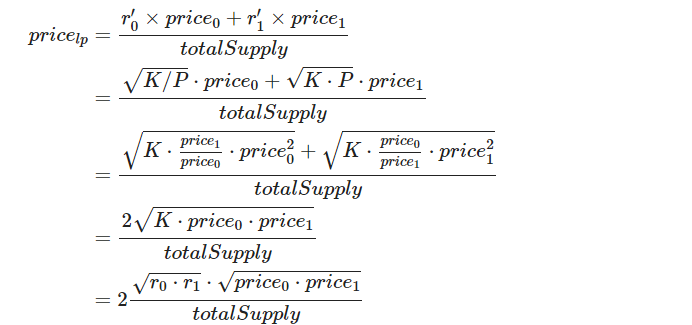
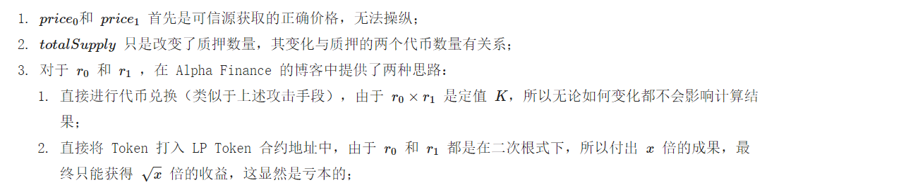

# LP Token 价格计算推导及安全性 

## 背景
在实现 LP池子时，需要计算 LP Token 的代币价值，从而方便的给用户提示 LP Token 当前准确的价格，来计算收益率。所以对 LP Token 的价值计算做了一点深入的研究，并且还翻阅到 Alpha Finance 团队的关于安全获取 LP 价格的方法。 本位将这些学习笔记分享给大家。​

## 一般 LP Token 价格的获取方法
我们知道对于一般 Token 的价格，在 Cex 中其实是市场上交易撮合的成交价。在 Dex 中，由于 AMM 做市商模型通过一组 LP 来构建价格的锚定。所以如果我们想获取到一个 Token 的价格，都是通过对于稳定币 USDT、USDC 或者 BUSD 的币对关系，从而反映现实世界的价格。​

我们知道 LP Token 是不具有流动性池的，如果有那就是套娃了。那么我们应该如何去计算价格呢？其实我们只需要用总增发量和货币价格反推即可。​


任意一个 Token X 的总市值是 Capx，是用当前的价格 Px 和当前总铸造数量Tx相乘可得。对于 LP Token，我们可以用这个公式来反推币价。因为在 LP Token 中，总市值是可以通过两种币的数量和对应价格求得，并且总的制造数量也是已知的。​

所以我们可以如此计算 LP Token 总价格：​


其中，r0和 r1就是 LP Token 合约中两种代币的存量，price0和 price1分别代表 r0和 r1 对应 Token 的价格。市面上无论 BSC、ETH 还是 Polygon 还是 Heco 链等，其 LP 代币基本都是 fork Uniswap 的，所以 r0和 r1、price0和 price1 都是能拿到的。​

上面的公式我们其实可以看出，是通过市值反推价格，也没有什么巨大的逻辑问题。当我们需要访问其币价的时候已经可以满足需求。在 Web3.js 前端中，我们就可以照此拿到结果。

```js
export const getLpTokenPrice = async (
  lpAddress: string,
  lib: any,
  price0: BigNumber,
  price1: BigNumber
) => {
  const lpToken = getPancakeLp(lib, lpAddress);
  let [r0, r1] = (await lpToken.getReserves()).map((n) => bignumberToBN(n));
  let totalSupply = bignumberToBN(await lpToken.totalSupply());
  return r0
    .multipliedBy(price0)
    .plus(r1.multipliedBy(price1))
    .dividedBy(totalSupply);
};
```
至此，我的需求完成。

## 延时喂价漏洞
对于上文公式：​


其实乍一看是不存在问题的。但是如果我们所做的需求，不仅仅是一个价格展示，而是一个借贷系统，用这种方式来获取清算系数，就会存在被闪电贷的风险。虽然 price0和 price1不能被操控，但是 r0和 r1是可以的。黑客可以通过操作 r0 和 r1，从而对价格实现控制。

之前漫雾团队写过一篇「Warp Finance 被黑详解」的分析，采用了如下攻击流程：

通过 dydx 与 Uniswap 闪电贷借出 DAI 和 WETH；
用小部分 DAI 和 WETH 在 Uniswap 的 WETH-DAI LP 中添加流动性，获得 LP Token；
将 LP Token 抵押到 Wrap Finance 中；
用巨量的 WETH 兑换成 DAI，因为 WETH 迅速进入了 WETH-DAI 流动池，总数量大增。但是由于价格使用的是 Uniswap 的预言机，访问的是 Uniswap 的 LP 池，所以 WETH 的价格并未发生变化。从而导致 Wrap Finance 中的 WETH-DAI LP Token 价格迅速提高；
由于 LP Token 单价变高，导致黑客抵押的 LP Token 可以借出更多的稳定币来获息。
​

这里，我们发现漏洞的关键地方，其实是 price 计算对于借贷项目中，使用的是他人的 LP 合约，还未等套利者来平衡价格，从而终究留出了时间差。​

为了解决这个问题，如果我们可以找到一种方式，从而规避价格查询，就能大概率防止上述漏洞。这里，Alpha Finance 给出了另外一个推导公式。

## 获取公平 LP 价格方法
首先我们在一个 LP 池中，我们能保证的是恒定乘积 KK 值的大小，我们定义价格比值是 PP，那么我们会有以下关系式：​


因为 r0 和 r1 在旧方法中是可以被操纵的，所以我们用 K 和 P 来反解真实的 r0′ 和 r1′ ：​


如此，我们在带入一开始计算 pricelp的公式中：​



我们可以发现，最终 Alpha Finance 给我们的推导式中，不会存在独立的 r0 和 r1 ，取而代之的是它们的恒定乘积 K。

## 攻击可能性分析
使用以上公式，我们可以真正的避免攻击吗？



 

 

综上，在已知情况下，是可以有效避免攻击的。

## 总结
通过这次对 LP Token 价格计算的研究，并且对延时喂价漏洞的探求，了解了 LP 抵押使用一般方式计算带来的风险。计算价格的需求，一定要根据所做业务的类型，谨慎选择。

## 参考链接
Alpha Finance 关于获取公平 LP 价格的方法

一种安全的 LP 价格的获取方法曾汨